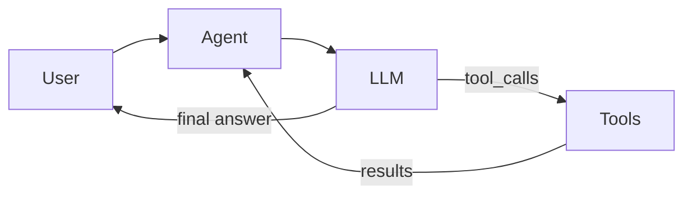

# PromptForge

A small **TypeScript AI agent** sample project for learning [Cursor Cloud Agents](https://cursor.com/docs/cloud-agent). It runs a tool-using agent loop with a built-in mock LLM (no API key required) and optional OpenAI support.

## What it does

PromptForge answers questions by deciding whether to call tools:

- **calculator** — evaluates basic math expressions
- **knowledge_lookup** — returns short explanations from a tiny built-in knowledge base

The agent loop looks like this:



## Quick start

```bash
npm install
npm test
npm run dev -- "What is 15 * 8?"
npm run dev -- --verbose "Tell me about RAG"
```

With an OpenAI key:

```bash
export OPENAI_API_KEY=sk-...
npm run dev -- "Explain embeddings in one sentence"
```

## Project layout

```
src/
  agent/Agent.ts      # Tool-using agent loop
  providers/          # Mock + OpenAI LLM providers
  tools/              # Calculator and knowledge lookup
  prompts/            # System prompt builder
  cli.ts              # Command-line interface
tests/
  agent.test.ts       # Vitest coverage
```

## Ideas for Cloud Agent practice

These are good starter tasks to assign a Cursor Cloud Agent:

1. **Add a `summarize` tool** that truncates long text to N words
2. **Expand the knowledge base** with entries for `llm`, `vector database`, and `prompt engineering`
3. **Add a `--json` CLI flag** that prints the full `AgentResult` (steps + iterations)
4. **Wire up GitHub Actions** to run `npm test` on every push
5. **Add an Anthropic provider** alongside OpenAI

## Scripts

| Command | Description |
|---------|-------------|
| `npm test` | Run Vitest tests |
| `npm run build` | Compile TypeScript to `dist/` |
| `npm run dev -- "<question>"` | Run the CLI with tsx |
| `npm run typecheck` | Type-check without emitting |

## License

MIT
